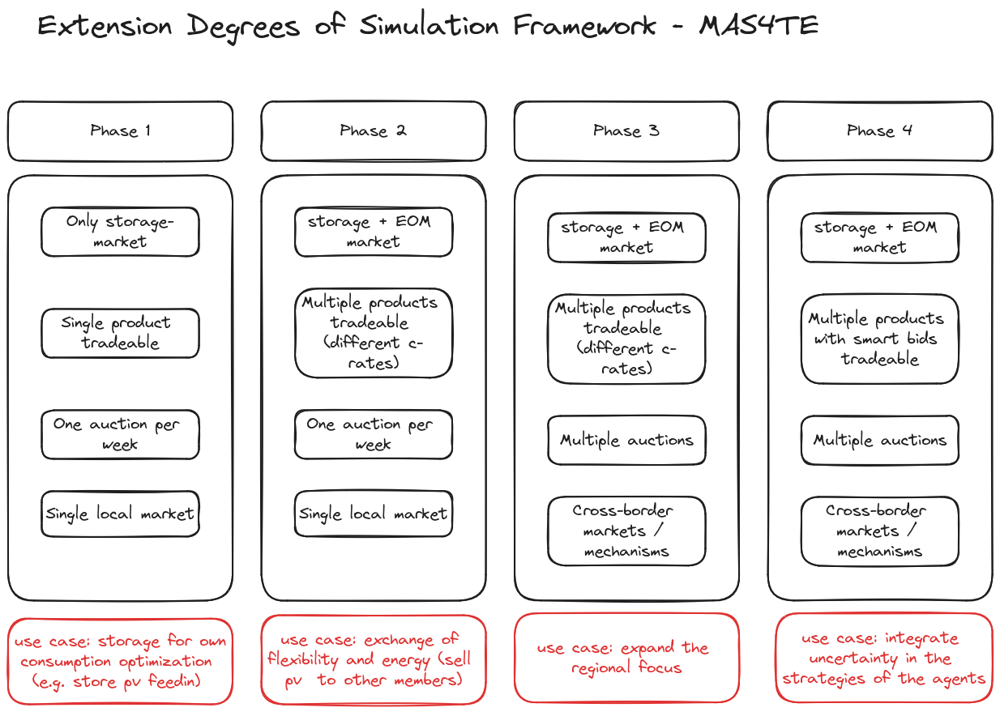

# MAS4TE project

This repository contains concepts and diagrams of the MAS4TE project.

## Overview

## Schedule

| Workshop | Content |
|----------|---------|
| [1. July](./2025-07-01-workshop/README.md)  | Concepts & Programming  |

## Sequence Diagram

[See here](./storage_market_seq_diagram.md)

## Product definitions
[See here](./virtual_products.md)

## Project phases

## Tools

- Git/GitHub for Version Control
- [Excalidraw](https://draw.nowum.fh-aachen.de/)
- [Diagrams.net](https://app.diagrams.net/)
- [Mermaid.js](https://mermaid.live/)
