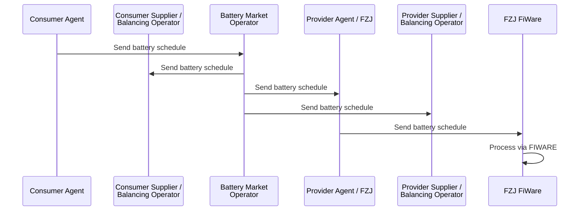

This diagram is only for the schedule of batteries. For the battery market process please [see here](./seq_diagrams/battery_market.md) and for the balancing process please [see here](./seq_diagrams/balancing.md).

