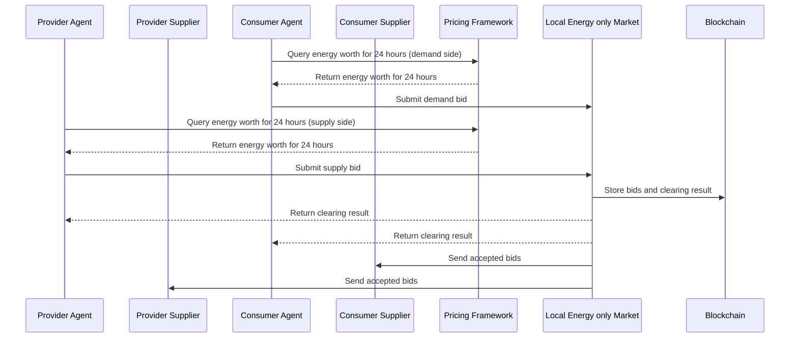

This diagram is only for the schedule of the energy only market (EOM). For the battery market process please [see here](./seq_diagrams/battery_market.md), for the scheduling process of the battery market please [see here](./seq_diagrams/battery_schedule_seq.md) and for the balancing process please [see here](./seq_diagrams/balancing.md).

