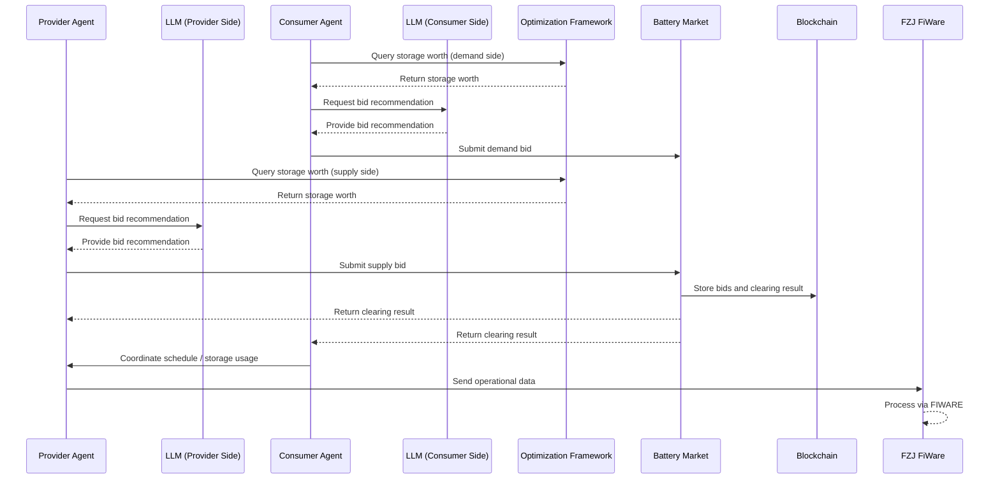

```mermaid
sequenceDiagram
    participant ProviderAgent as Provider Agent
    participant LLM_Provider as LLM (Provider Side)
    participant ConsumerAgent as Consumer Agent
    participant LLM_Consumer as LLM (Consumer Side)
    participant OptFramework as Optimization Framework
    participant Market as Battery Market
    participant Blockchain
    participant FZJ as FZJ FiWare

    ConsumerAgent->>OptFramework: Query storage worth (demand side)
    OptFramework-->>ConsumerAgent: Return storage worth

    ConsumerAgent->>LLM_Consumer: Request bid recommendation

    LLM_Consumer-->>ConsumerAgent: Provide bid recommendation

    ConsumerAgent->>Market: Submit demand bid

    ProviderAgent->>OptFramework: Query storage worth (supply side)
    OptFramework-->>ProviderAgent: Return storage worth

    ProviderAgent->>LLM_Provider: Request bid recommendation

    LLM_Provider-->>ProviderAgent: Provide bid recommendation

    ProviderAgent->>Market: Submit supply bid

    Market->>Blockchain: Store bids and clearing result
    Market-->>ProviderAgent: Return clearing result
    Market-->>ConsumerAgent: Return clearing result

    ConsumerAgent->>ProviderAgent: Coordinate schedule / storage usage

    ProviderAgent->>FZJ: Send operational data
    FZJ-->>FZJ: Process via FIWARE
```
