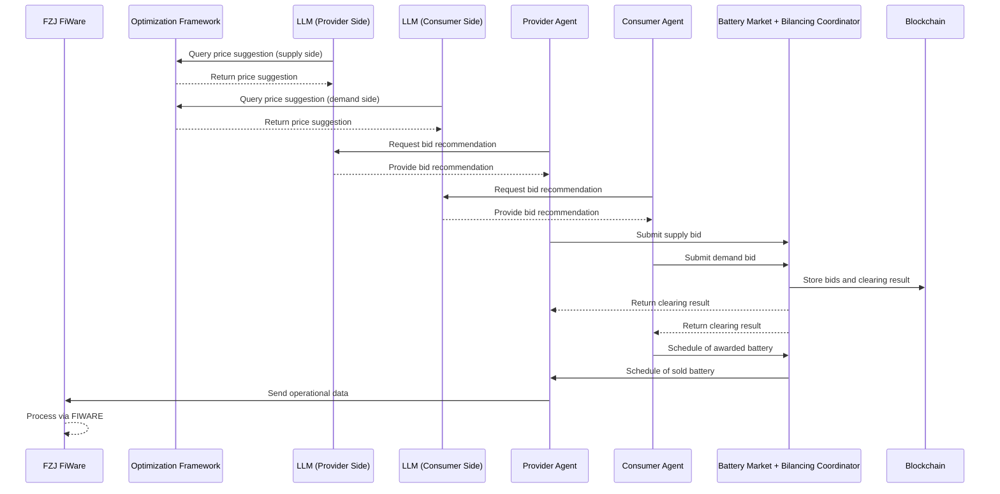

```mermaid
sequenceDiagram
    participant FZJ as FZJ FiWare
    participant OptFramework as Optimization Framework
    participant LLM_Provider as LLM (Provider Side)
    participant LLM_Consumer as LLM (Consumer Side)
    participant ProviderAgent as Provider Agent
    participant ConsumerAgent as Consumer Agent
    participant Market as Battery Market + Bilancing Coordinator
    participant Blockchain

    LLM_Provider->>OptFramework: Query price suggestion (supply side)
    OptFramework-->>LLM_Provider: Return price suggestion

    LLM_Consumer->>OptFramework: Query price suggestion (demand side)
    OptFramework-->>LLM_Consumer: Return price suggestion

    ProviderAgent->>LLM_Provider: Request bid recommendation
    LLM_Provider-->>ProviderAgent: Provide bid recommendation

    ConsumerAgent->>LLM_Consumer: Request bid recommendation
    LLM_Consumer-->>ConsumerAgent: Provide bid recommendation

    ProviderAgent->>Market: Submit supply bid
    ConsumerAgent->>Market: Submit demand bid

    Market->>Blockchain: Store bids and clearing result
    Market-->>ProviderAgent: Return clearing result
    Market-->>ConsumerAgent: Return clearing result

    ConsumerAgent->>Market: Schedule of awarded battery
    Market->>ProviderAgent: Schedule of sold battery

    ProviderAgent->>FZJ: Send operational data
    FZJ-->>FZJ: Process via FIWARE
```